#  브라질 E-commerce Olist 배송기간 예측 프로젝트

팀원 :  김강현, 김주성, 이힘찬, 윤민우, 임윤정

## 프로젝트 정보

### 1.  프로젝트 주제 

   브라질 E-commerce회사인 Olist의 거래 정보 데이터(https://www.kaggle.com/olistbr/brazilian-ecommerce) 를 활용한 배송기간예측

   

### 2.  주제 선정 배경 및 개요

   * 브라질의 배송환경은 국내와 다르게 굉장히 오랜시간이 걸리고, 도심과 비도심의 배송기간의 격차가 큽니다. 따라서 본 프로젝트를 통해 브라질의 Olist를 이용하는 고객에게 예상 배송기간을 예측하고, 더 나아가 이 서비스를 Olist측에 제안하는 형태로 진행했습니다.

   * 브라질 E-commerce의 유니콘 기업인 Olist에 배송기간예측서비스 제공이라는 제안을 하여 고정고객 확보와 더 나아가 이용고객에게 만족을 도모한다.  
   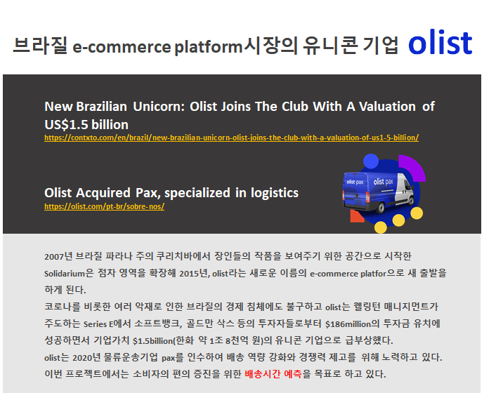

   

### 3. 프로젝트 환경

   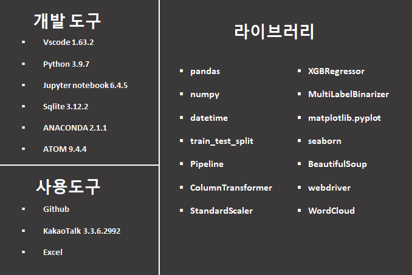
 
 
### 4. 데이터 수집 및 전처리 

데이터는 캐글 Olist의 거래 정보 데이터(https://www.kaggle.com/olistbr/brazilian-ecommerce) 를 활용함.
데이터셋의 ERD는 다음과 같다.

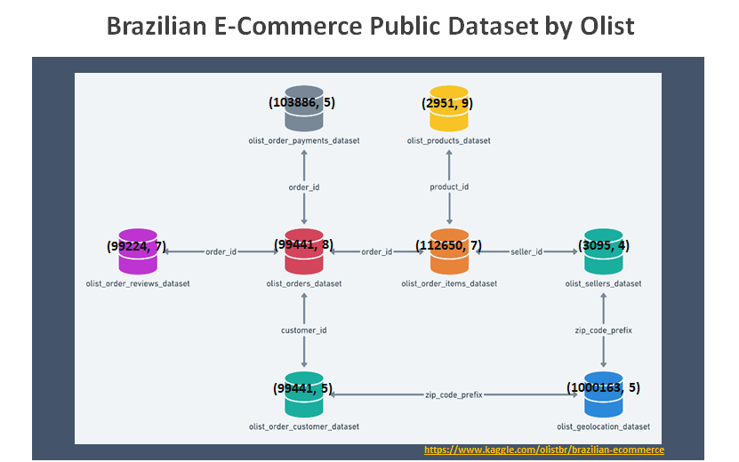

이중에서 분석에 필요한 컬러만 팀 회의를 통해 선정

  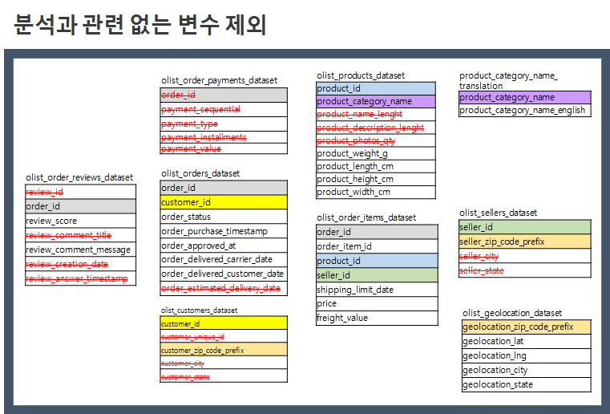
  
다음과 같은 변수들을 선정함

* 이후 포르투갈어로 된 product_category_name을 product_category_name_english로 1:1 매칭 시켜줌

* 데이터는 배송이 완료된 데이터만을 가지고 분석을 진행

* 제품의 높이, 폭, 길이의 컬럼을 부피라는 컬럼으로 전처리 함 

* 결측치는 제품의 크기에 관련한 것은 해당 제품의 카테고리 평균치로 처리 

* 제품의 카테고리가 결측치인 경우 other로 처리

### 5. EDA 

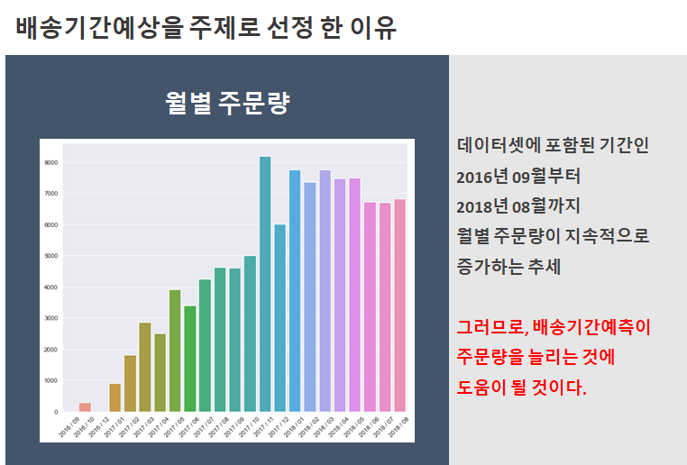
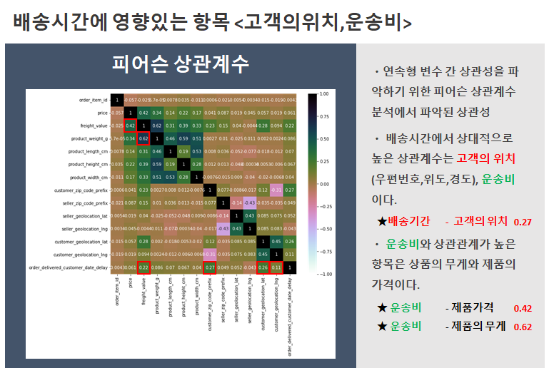
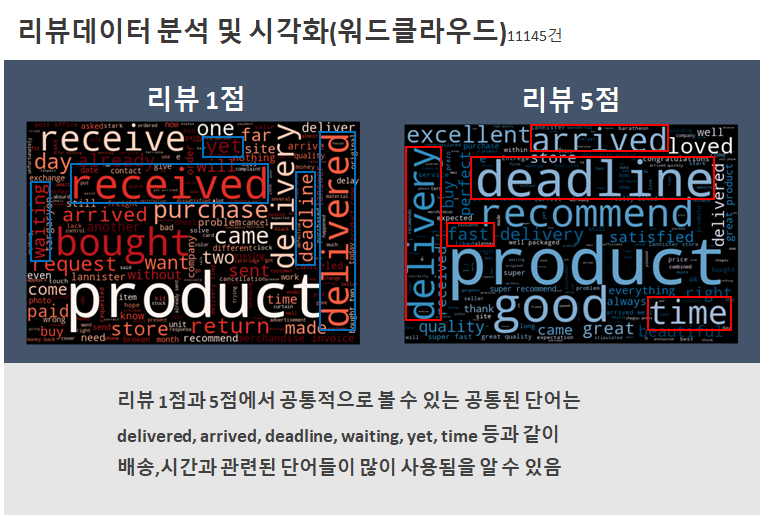
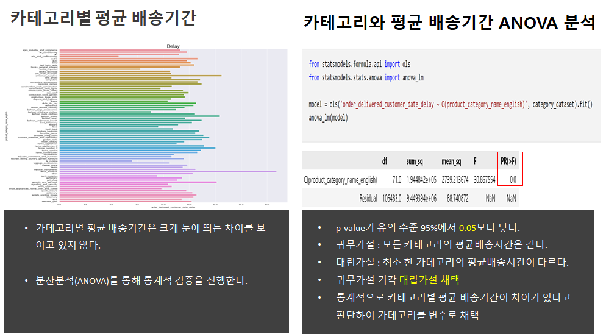
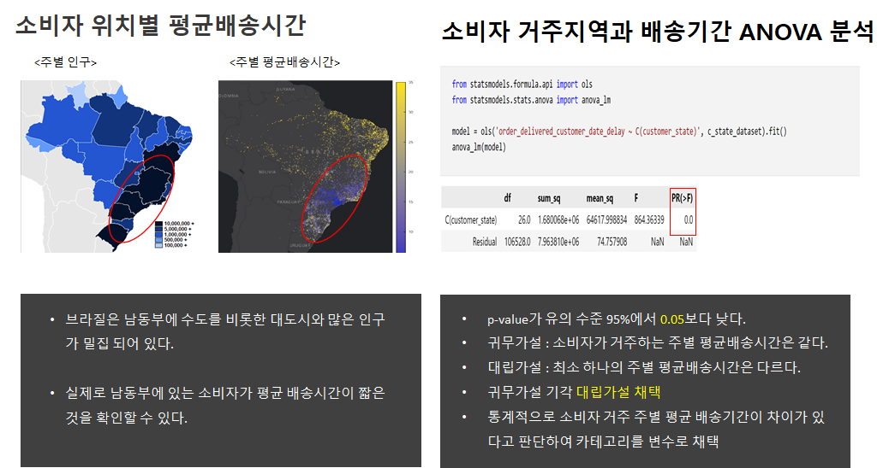
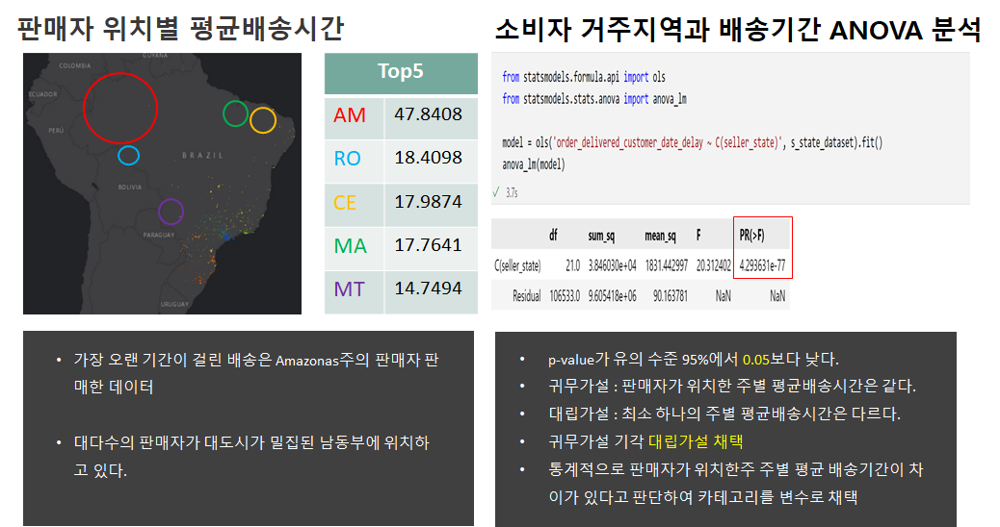

### 6. 파생변수

* 선행된 연구에서는 판매자와 구매자의 위도와 경도를 활용해 geopy 라이브러리를 활용해 지구의 구를 반영한 직선거리를 채택해 분석에 활용했다. 
 하지만, 배송기간예측이라는 목적에는 실제 차량이동거리가 더 주요할 것이라고 판단하여, 실제 차량이 이동한 거리를 크롤링을 진행했다. 시간은 PC 5대로 총 25시간이 걸렸다.  
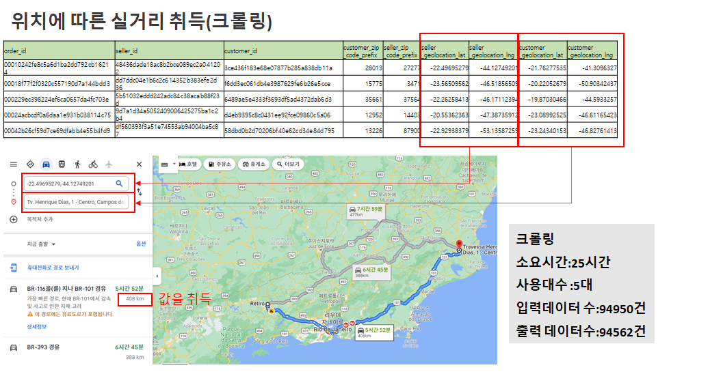

### 7. 모델링
* 모델링에는 총 10개의 회귀모형을 사용했으며, 각 각 파생변수 추가 전, 후 geopy가 아닌 실제 이동거리를 적용한 데이터셋 총 3번의 모델링을 진행했다. 

* 이때는 각각 모델의 디폴트 값으로 모델링을 진행했다.

* 데이터셋이 배송기간예측을 위한 셋이 아니다 보니 결과는 좋지 않게 나왔다. 

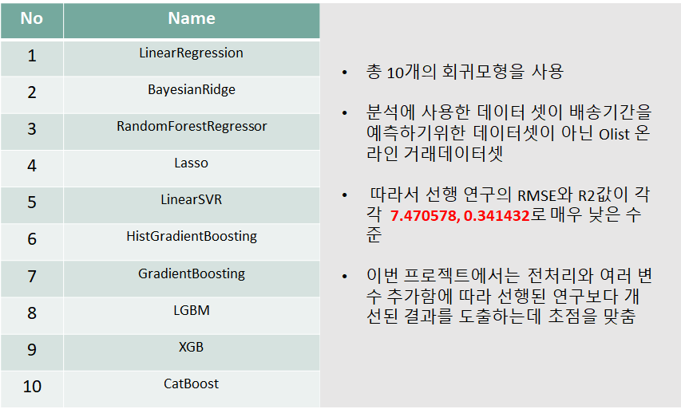

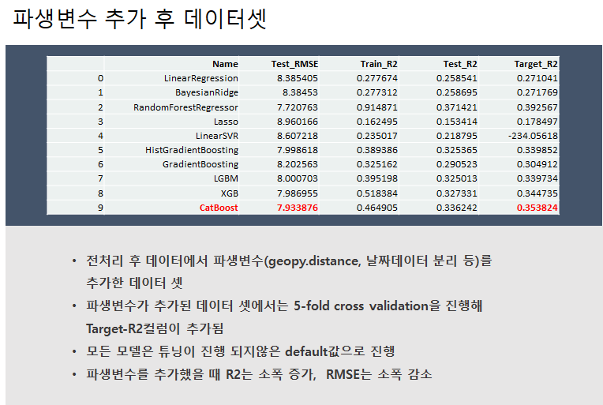
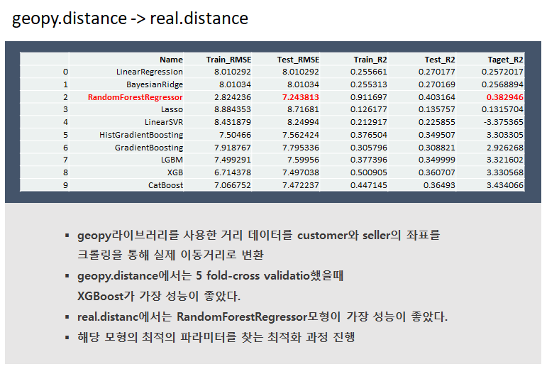
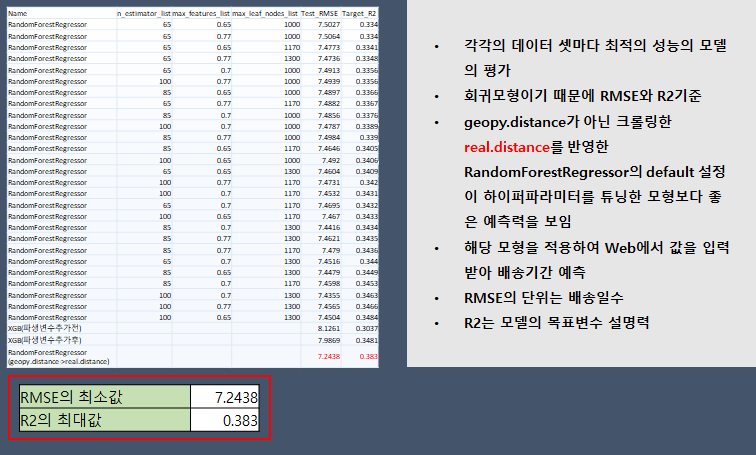

### 8. 프로젝트 시연

   

### 9. 결론
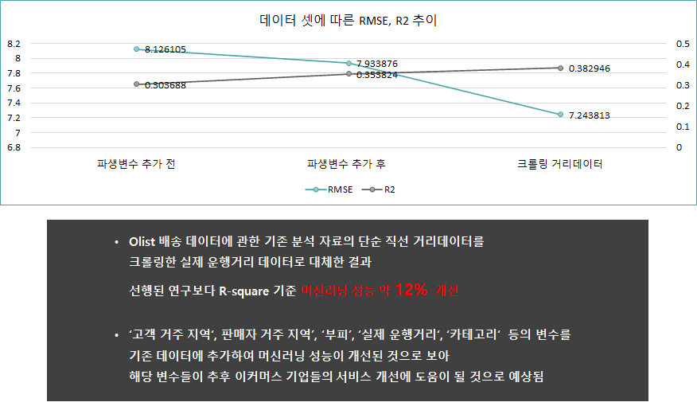

### 10. 프로젝트 한계점 및 개선점

* 배송기간예측에 최적화 된 데이터셋이 아니라 EDA로 주로 활용되는 데이터셋을 가지고 예측프로젝트를 진행하다 보니 배송기간예측에 주요하게 활용될만한 컬럼이 부족했다고 생각함.

* 다양한 모델의 하이퍼파라미터 조정을 통해 조금더 개선된 모델의 성능을 이끌어 낼 수 있을 것 같다. 

